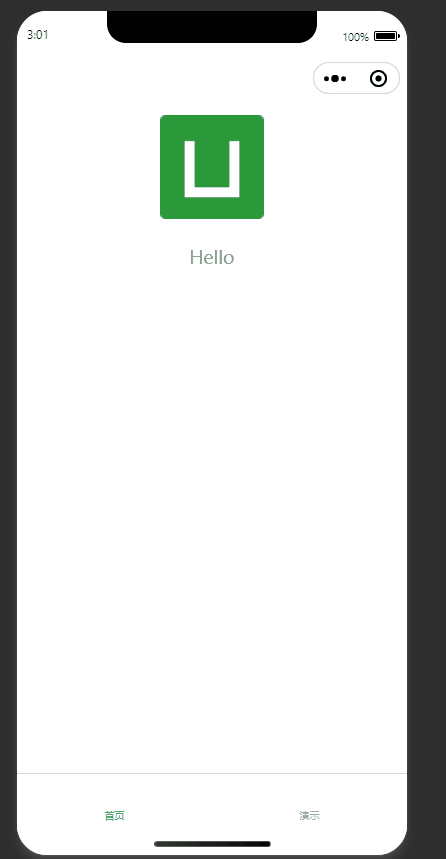

<h1 align="center">
UniApp Vue3 TypeScript 模板
</h1>

<p align="center">
  
  
  
  
  
  
</p>

## 简介

这是一个基于 UniApp + Vue 3 + TypeScript + Vite 的现代化跨平台应用开发模板，集成了多种实用工具和最佳实践，适用于快速开发iOS、Android、H5、小程序等多端应用。此模板在uniapp官方模板[vite-ts](https://github.com/dcloudio/uni-preset-vue/tree/vite-ts)上进行加强。

## 文档

[请查看文档](http://localhost:5173)

## 分支

| 分支   | 说明                     | github地址 | gitee地址 |
| ------ | ------------------------ | ---------- | --------- |
| master | master分支没集成ui组件库 |            |           |
| uni-ui | 集成DCloud官方UI组件库   |            |           |
| wot-ui | 集成Wot UI组件库         |            |           |

## 技术栈

- [UniApp](https://uniapp.dcloud.io/) - 跨平台应用开发框架
- [Vue 3](https://v3.vuejs.org/) - 渐进式 JavaScript 框架，使用 Composition API
- [TypeScript](https://www.typescriptlang.org/) - JavaScript 的超集，添加了静态类型
- [Vite](https://vitejs.dev/) - 快速的构建工具，提供极速的开发体验
- [EditorConfig](https://editorconfig.org/) - 跨编辑器和IDE的代码格式一致性工具
- [Prettier](https://prettier.io/) - 代码格式化工具
- [ESLint](https://eslint.org/) - JavaScript/TypeScript代码检查工具
- [Stylelint](https://stylelint.io/) - CSS/SCSS代码检查工具
- [Husky](https://typicode.github.io/husky/) - Git hooks工具
- [Lint-staged](https://github.com/okonet/lint-staged) - 对暂存的git文件运行linters的工具
- [Commitlint](https://commitlint.js.org/) - Git commit信息校验工具
- [UnoCSS](https://unocss.dev/) - 即时按需原子 CSS 引擎
- [Pinia](https://pinia.vuejs.org/) - Vue 的轻量级状态管理库
- [Day.js](https://day.js.org/) - 轻量级日期处理库
- [Lodash](https://lodash.com/) - JavaScript 工具库
- [z-paging](https://github.com/SmileZXLee/uniapp-z-paging) - UniApp 下拉刷新和上拉加载插件
- [Auto Import](https://github.com/antfu/unplugin-auto-import) - 自动按需导入 API
- [dcloudio/uni-preset-vue](https://github.com/dcloudio/uni-preset-vue/tree/vite-ts) - UniApp官方vue3-ts模板
- [uni-ui](https://uniapp.dcloud.io/component/uniui/uni-ui) - DCloud官方UI组件库，提供丰富的移动端组件
- [wot-ui](https://github.com/Moonofweisheng/wot-ui) - 基于Vue3+TS开发的uni-app组件库，轻量、简洁

## 功能演示页面

项目包含了多个功能演示页面：

- 首页 (index)
- 功能演示列表 (demo)
- Pinia 状态管理演示 (pinia)
- UnoCSS 样式演示 (unocss)
- Day.js 日期处理演示 (dayjs)
- z-paging 分页组件演示 (zpaging)
- Lodash 工具库演示 (lodash)
- 网络请求演示 (request)

## 演示效果



## 快速开始

### 环境要求

- Node.js >= 20
- pnpm (推荐) / npm / yarn
- vcode

### 安装依赖

```bash
pnpm install
```

### 开发环境

```bash
# 启动 H5 开发环境
pnpm run dev:h5

# 启动微信小程序开发环境
pnpm run dev:mp-weixin

# 启动其他平台（将PLATFORM替换为对应平台标识）
pnpm run dev:PLATFORM
```

### 构建项目

```bash
# 构建 H5
pnpm run build:h5

# 构建微信小程序
pnpm run build:mp-weixin

# 构建其他平台（将PLATFORM替换为对应平台标识）
pnpm run build:PLATFORM
```

### 其他命令

```bash
# TypeScript 类型检查
pnpm run type-check

# 清理 node_modules
pnpm run clean

# 清理缓存
pnpm run clean:cache

# ESLint 代码检查并自动修复
pnpm run lint:eslint

# Prettier 代码格式化
pnpm run lint:prettier

# Stylelint 样式检查并自动修复
pnpm run lint:stylelint
```

## 部署

### Nginx 部署

1. 构建 H5 项目：
   ```bash
   pnpm run build:h5
   ```
2. 将生成的文件（位于 `dist/build/h5/`）复制到 Nginx 服务器的静态文件目录
3. 配置 Nginx 支持 Vue Router 的 history 模式：
   ```nginx
   server {
       listen 80;
       server_name your-domain.com;
       root /var/www/html/dist/build/h5;
       index index.html;
       
       location / {
           try_files $uri $uri/ /index.html;
       }
       
       # 静态资源缓存
       location ~* \.(js|css|png|jpg|jpeg|gif|ico|svg)$ {
           expires 1y;
           add_header Cache-Control "public, immutable";
       }
   }
   ```

### Docker 部署

项目提供了 Docker 支持，可以快速部署 H5 应用。

#### 使用 Docker 命令部署

```bash
# 构建镜像
docker build -t uniapp-h5 .

# 运行容器
docker run -d -p 80:80 --name uniapp-h5-container uniapp-h5
```

#### 使用 Docker Compose 部署

```bash
# 使用 docker-compose 构建和启动服务
docker-compose up -d

# 停止并删除服务
docker-compose down
```

#### 使用 nerdctl 部署

nerdctl 是一个与 Docker 兼容的 containerd CLI 工具，可以作为 Docker 的替代品使用：

```bash
# 构建镜像
nerdctl build -t uniapp-h5 .

# 运行容器
nerdctl run -d -p 80:80 --name uniapp-h5-container uniapp-h5

# 查看运行中的容器
nerdctl ps

# 停止容器
nerdctl stop uniapp-h5-container

# 删除容器
nerdctl rm uniapp-h5-container

# 删除镜像
nerdctl rmi uniapp-h5
```

#### 使用 nerdctl compose 部署

```bash
# 使用 nerdctl-compose 构建和启动服务
nerdctl compose up -d

# 停止并删除服务
nerdctl-compose down
```

## 项目结构

```
src/
├── pages/           # 页面组件
│   ├── index/       # 首页
│   ├── demo/        # 功能演示列表
│   ├── pinia/       # Pinia 状态管理演示
│   ├── unocss/      # UnoCSS 样式演示
│   ├── dayjs/       # Day.js 日期处理演示
│   ├── zpaging/     # z-paging 分页组件演示
│   ├── lodash/      # Lodash 工具库演示
│   └── request/     # 网络请求演示
├── stores/          # Pinia 状态管理
│   ├── modules/     # 状态模块
│   └── index.ts     # 状态管理入口
├── types/           # TypeScript 类型定义
├── utils/           # 工具函数
├── App.vue          # 根组件
├── main.ts          # 入口文件
├── pages.json       # 页面路由配置
├── manifest.json    # 应用配置
└── uni.scss         # 全局样式
```

## 许可证

[MIT](./LICENSE)